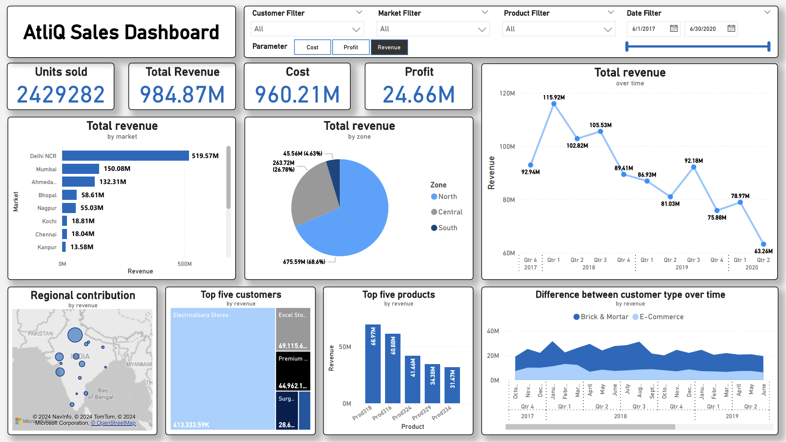

# AtliQ sales data analysis and dashboard visualization
`SQL`, `PowerBI`, `Tableau`, `Python`, `data manipulation`, `data analysis`, `data visualization`

Mason Phung

## A small data analysis project with SQL and PowerBI.

AtliQ is a B2B hardware & peripheral manufacturer headquartered in Mumbai, they have many regional branches across India. The company provides computer and network equipments for other businesses. In the previous quarter, the company was reported to have declining sales and their Sales director is having trouble tracking where business is falling in the local Indian market. We will help them to determine the issues by analyze and visualize their sales data.

Expected results:
- Provide an exploratory data analysis report.
- Provide a real-time dashboard to support data driven decision making.

Success criteria
- Provide valuable insights by exploring the datasets.
- The dashboard is able to provide up-to-date sales data automatically.
- Data team: data collecting and visualizing change to automatic, thus save more time & resources.
- Sales team is able to make better decision, cut down cost and gain more sales by a %.

Data analysis questions:
- Are there any trends on customer purchase behavior throughout the years?
- Is the any issues with certain products/markets/customers?
- What are the bottlenecks/problems that cause the decline in sales in certain markets?
- Any suggestions can be made to tackle found issues?

Special thanks to `codebasics` for problem statement and case explanation. Data mining, analysis and visualization by Mason Phung.
Case source: https://youtu.be/CCNd2fUfFkk

## Project processes
- Step 1: **Database management & Data processing**: Set up local MySQL database and import data by reading `.sql` dumb file.
- Step 2: **Data cleaning**: Using Python to clean data, then export them back to MySQL database.
- Step 3: **Exploratory analysis**: Using SQL, with the help of `sqlalchemy` to present the analysis.
- Step 4: **Data visualization**: Using PowerBI, load the data directly from MySQL database.

## Dashboard features
*New dashboard in PowerBI from ver 2.0*
- Interactive dashboard changed based on filters & selection.
- Automatically update new data from database.
- Changable/Comparable observing parameters: Revenue, Cost and Price - Look the statistics for in different aspects.

## The repo contains 4 files
- `atliq_report.pdf`: Project report, including project information, process summary, analysis insights.
- `atliq_sql_data_analysis.ipynb`: Data mining with Python and analysis using SQL.
- `atliq_data_visualization.twb`: Tableau workbook of the dashboard and plot sheets. Data pulled from the local MySQL database.
- `atliq_dashboard.pbix`: PowerBI dashboard, built with the data pulled from the local MySQL database.
- `requirements.txt`: Required Python packages for data analysis.
- `/dump`: SQL dump files, including a dumb used in the project and a backup version.
- `/img`: Related images about the projects, used in reports and github readme.

## Tools
- Local database: MySQL 
- Database management: MySQL Benchmark or DBeaver (for its compatibility with MacOS ARM).   
- IDE: Visual Studio Code
- Python libraries: sqlalchemy, pandas, numpy (for data mining, data manipulation)

## Notes
- Create a local MySQL database and initialize using `mysqlalchemy`.
- Import dumps into the database using `DBeaver` or `MySQL Benchmark`.

## Latest update: ver 2.0
- Upload a jupyter notebook includes SQL queries and Python data manipulation process
- Create a refined interactive dashboard using Power BI

## Uploads
- 2024/08/07: Update ver 2.0
- 2023/10/18: Update ver 1.0
